

  <button class="btn active" data-tag="all">All</button>
  <button class="btn" data-tag="2013">2013</button>
  <button class="btn" data-tag="2015">2015</button>
  <!-- <button class="btn" data-tag="2017">2017</button> -->
  <button class="btn" data-tag="2018">2018</button>
  <button class="btn" data-tag="2019">2019</button>
  <button class="btn" data-tag="2020">2020</button>
  <button class="btn" data-tag="2021">2021</button>
  <button class="btn" data-tag="2022">2022</button>

 

  <!-- 2022 ANYmal Stair Climbing -->
  

    <table style="width:100%;">
      <tr>
        <td style="width:50%; padding-right: 10px; min-height: 300px;">
          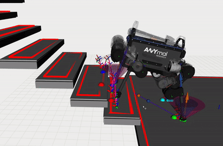
        </td>
        <td style="width:50%; vertical-align:top; font-size: 14px;">
          <b>ANYmal Stair Climbing</b>
            
          In Edinburgh, most of my time was spent on ANYmal stair climbing for the Memory of Motion (Memmo) project. The GIF on the left was recorded on Sunday 4am...
            
          Research <a href="../research">[Link]</a> 
          Perceptive Locomotion Video <a href="https://youtu.be/W4HHLMNbcXo">[Link]</a> 
        </td>
      </tr>
    </table>
  

  <!-- 2022 Talos State Estimation -->
  

    <table style="width:100%;">
      <tr>
        <td style="width:65%; vertical-align:top; font-size: 14px;">
          <b>Talos State Estimation</b>
            
          I developed Vicon state estimation integration for Talos. The proprioceptive state estimation couldn't give accurate estimates of the current pose, so I used the robot_localization package to fuse ground truth measurements from Vicon into it. The same problem occurred with ANYmal when it jumped, so I also used this integration to resolve the problem. Additionally, I collaborated on deploying a Centroidal Dynamics motion planner on the real Talos robot and developed ROS integration for it.
            
          Robot Localization Wiki <a href="http://docs.ros.org/en/noetic/api/robot_localization/html/index.html">[Link]</a>
        </td>
        <td style="width:35%; padding-right: 10px; min-height: 300px;">
          
          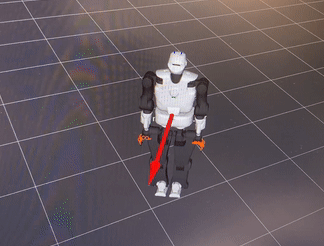
        </td>
      </tr>
    </table>
  

  <!-- 2022 Kawada Nextage -->
  

    <table style="width:100%;">
      <tr>
        <td style="width:40%; padding-right: 10px; min-height: 300px;">
          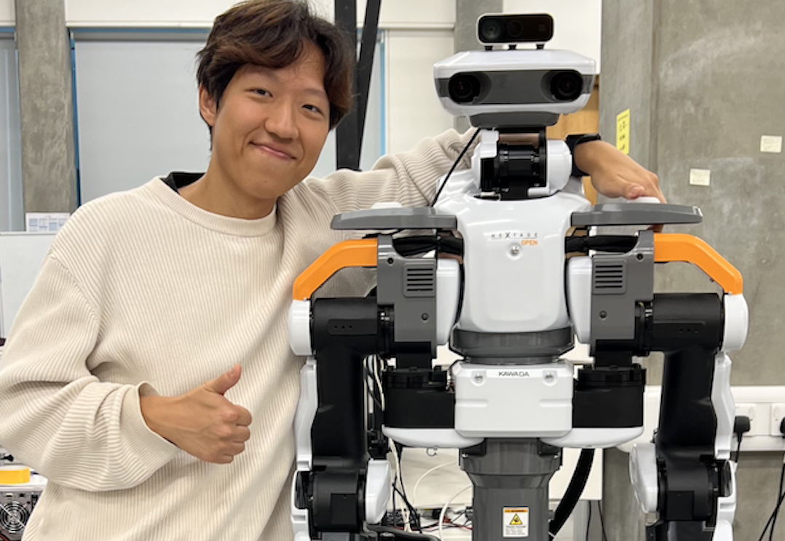
        </td>
        <td style="width:60%; vertical-align:top; font-size: 14px;">
          <b>Kawada Nextage</b>
            
          I did many tasks for the Nextage robot, including manual writing, maintenance, giving robot usage tutorials to lab members, and providing feedback on the Kawada project.
            
          Pic taken on the last day of work.
        </td>
      </tr>
    </table>
  

  <!-- 2022 ODRI Solo -->
  

    <table style="width:100%;">
      <tr>
        <td style="width:60%; vertical-align:top; font-size: 14px;">
          <b>ODRI Solo</b>
            
          Solo was designed and developed by the Open Dynamic Robot Initiative (ODRI). For the use of the robot within the lab, I created a software framework and feedforward PD controller of this robot.
            
          ODRI Solo <a href="https://open-dynamic-robot-initiative.github.io/">[Link]</a>
        </td>
        <td style="width:40%; padding-right: 10px; min-height: 300px;">
          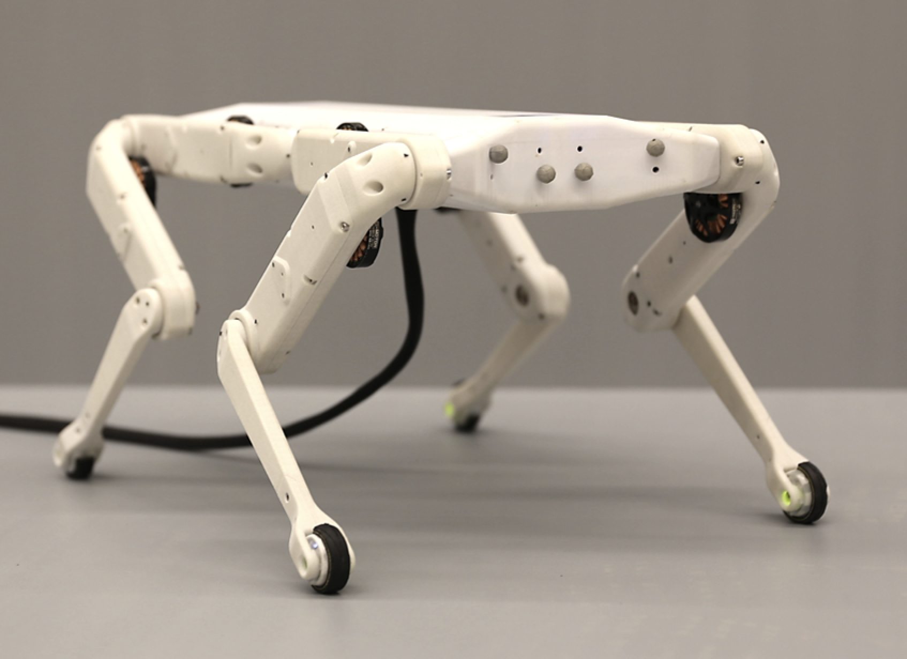
        </td>
      </tr>
    </table>
  

  <!-- 2021 ZIPGAEMI -->
  

    <table style="width:100%;">
      <tr>
        <td style="width:50%; padding-right: 10px; min-height: 300px;">
          
        </td>
        <td style="width:50%; vertical-align:top; font-size: 14px;">
          <b>ZIPGAEMI, an indoor delivery robot</b>
            
          I participated in the development of 'ZIPGAEMI', a wheeled mobile manipulator robot designed for indoor delivery purposes. It was a large team project that enabled the robot to navigate, detect elevator buttons, ride elevators, and deliver amenities to customers' rooms. Specifically, I took charge of the development of the software framework for the wheeled base.
            
          It was my final project at ROBOTIS and I finally finished my long military replacement service.
            
          Full Video <a href="https://youtu.be/6leVDb6EHi4">[Link]</a> 
        </td>
      </tr>
    </table>
  

  <!-- 2021 VSCode ROS2 -->
  

    <table style="width:100%;">
      <tr>
        <td style="width:40%; vertical-align:top; font-size: 14px;">
          <b>VSCode ROS2 Extension</b>
            
          I've developed a ROS2 snippet extension to simplify ROS2 programming. At the time of writing this article, nearly 10,000 users are using it. Also the extension I made for ROS1 reached over 10,000 users a while back.
            
          ROS VSCode Extension <a href="https://marketplace.visualstudio.com/items?itemName=JaehyunShim.vscode-ros">[Link]</a> 
          ROS2 VSCode Extension <a href="https://marketplace.visualstudio.com/items?itemName=JaehyunShim.vscode-ros2">[Link]</a>
        </td>
        <td style="width:60%; padding-right: 10px; min-height: 300px;">
          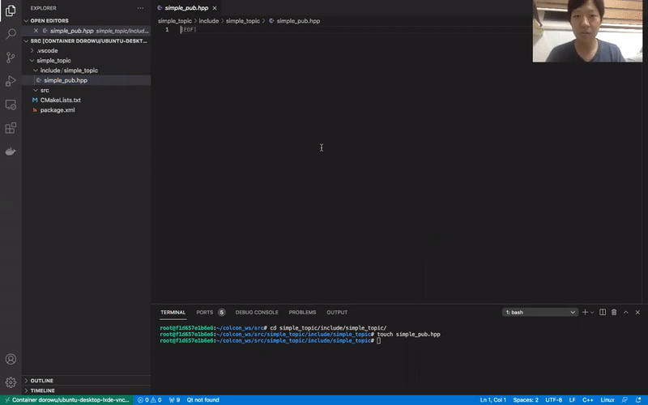
        </td>
      </tr>
    </table>
  

  <!-- 2020 Generic Software Framework for Legged Robots -->
  

    <table style="width:100%;">
      <tr>
        <td style="width:60%; padding-right: 10px; min-height: 300px;">
          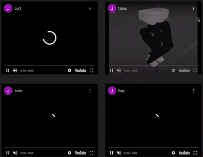
        </td>
        <td style="width:40%; vertical-align:top; font-size: 14px;">
          <b>Generic Software Framework for Legged Robots</b>
            
          As a side project, I created a generic software framework for legged robots using the ROS Control library. I made both ROS and ROS2 versions, and I even made a setup assistant using Qt. This was a spin-off project from a previous project I participated in. I am deeply grateful to all the members of the group who I met there and exchanged ideas with every Friday night.
            
          Group Youtube Channel <a href="https://www.youtube.com/@dynamics5776/videos">[Link]</a> 
        </td>
      </tr>
    </table>
  

  <!-- 2019 OpenSource Robots -->
  

    <table style="width:100%;">
      <tr>
        <td style="width:50%; vertical-align:top; font-size: 14px;">
          <b>OpenSource Robots</b>
            
          During my time at ROBOTIS, I had the opportunity to work on open-source projects including Turtlebot3, OpenManipulator, RH Gripper, and Dynamixel. I utilized many software tools and libraries and was involved in the development of software architecture, demos, GUI, performance checks, and CI/CD. It was a valuable experience to contribute to the ROS community by holding hackathons and ensuring seamless communication with users.
            
          ROBOTIS OpenSource Robot <a href="https://emanual.robotis.com/docs/en/platform/">[Link]</a> 
          ROBOTIS Github <a href="https://github.com/ROBOTIS-GIT">[Link]</a> 
        </td>
        <td style="width:50%; padding-right: 10px; min-height: 300px;">
          <table style="width:100%; height:100%;">
            <tr>
              <td style="width:50%; height:50%; padding: 1px;">
                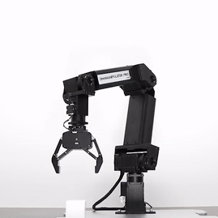
              </td>
              <td style="width:50%; height:50%; padding: 1px;">
                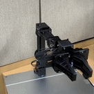
              </td>
            </tr>
            <tr>
              <td style="width:50%; height:50%; padding: 1px;">
                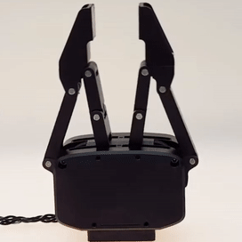
              </td>
              <td style="width:50%; height:50%; padding: 1px;">
                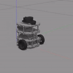
              </td>
            </tr>
          </table>
        </td>
      </tr>
    </table>
  

  <!-- 2018 OM Friends -->
  

    <table style="width:100%;">
      <tr>
        <td style="width:50%; padding-right: 10px; min-height: 300px;">
          <table style="width:100%; height:100%;">
            <tr>
              <td style="width:50%; height:50%; padding: 1px;">
                
              </td>
              <td style="width:50%; height:50%; padding: 1px;">
                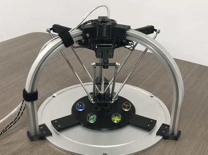
              </td>
            </tr>
            <tr>
              <td style="width:50%; height:50%; padding: 1px;">
                
              </td>
              <td style="width:50%; height:50%; padding: 1px;">
                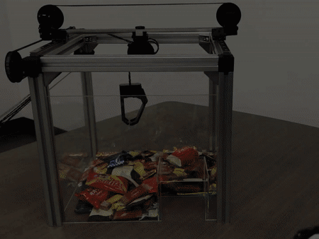
              </td>
            </tr>
          </table>
        </td>
        <td style="width:50%; vertical-align:top; font-size: 14px;">
          <b>OpenManipulator Friends</b>
            
          I joined ROBOTIS in Korea and worked on OpenManipulator Friends, which are open-source, customizable, small-sized serial and parallel manipulators including Stewart, Delta, Planar, Linear, and SCARA. My work involved modifying existing hardware designs using Onshape, 3D printing, assembling the parts, implementing forward and inverse kinematics, and brainstorming demo ideas. It was a challenging experience with many 9-to-9 work days, but it was also very rewarding with unforgettable moments of joy when every demo video was released.
            
          OpenManipulator Friends <a href="https://emanual.robotis.com/docs/en/platform/openmanipulator_x/friends/#friends">[Link]</a> 
        </td>
      </tr>
    </table>
  

  <!-- 2017 Grad School -->
  <!-- 

    <table style="width:100%;">
      <tr>
        <td style="width:50%; padding-right: 10px; min-height: 300px;">
          
        </td>
        <td style="width:50%; vertical-align:top; font-size: 14px;">
          대학원 연구 영상
        </td>
      </tr>
    </table>
  
 -->

  <!-- 2015 PR2 Lab Introduction -->
  

    <table style="width:100%;">
      <tr>
        <td style="width:70%; vertical-align:top; font-size: 14px;">
          <b>PR2 Lab Introduction</b>
            
          I did a five-month internship in Shenzhen. I had the opportunity to work on robot control with PR2 for the first time. During my internship, I acquired C++, Python, and ROS (Robot Operating System) skills. At the end of the internship, I developed a demo that the robot navigating around the lab while introducing the lab and the robot itself.
            
          Used libraries: mapping, navigation, joint control, and sound play
        </td>
        <td style="width:30%; padding-right: 10px; min-height: 300px;">
          
        </td>
      </tr>
    </table>
  

  <!-- 2015 University of Tokyo -->
  <!-- 

    <table style="width:100%;">
      <tr>
        <td style="width:50%; padding-right: 10px; min-height: 300px;">
          
        </td>
        <td style="width:50%; vertical-align:top; font-size: 14px;">
          프로젝트, 연구 영상
        </td>
      </tr>
    </table>
  
 -->

  <!-- 2013 Hand Detection -->
  

    <table style="width:100%;">
      <tr>
        <td style="width:50%; padding-right: 10px; min-height: 300px;">
          
        </td>
        <td style="width:50%; vertical-align:top; font-size: 14px;">
          <b>Hand Detection</b>
            
          During my 2nd and 3rd years of uni, all I can recall is developing, developing, and more developing. In one project, I created a virtual hand using OpenGL and programmed it to imitate the hand movements detected using OpenCV.
            
          After the Battleship competition, I ended up in 2nd place once again :)
        </td>
      </tr>
    </table>
  

  <!-- 2013 Robot Hand Control -->
  

    <table style="width:100%;">
      <tr>
        <td style="width:50%; vertical-align:top; font-size: 14px;">
          <b>Robot Hand</b>
            
          I was up for three nights straight, designing finger structures, cutting aluminium plates, drilling holes, and assembling them. But, during the demonstration, the gears ended up breaking.
            
          It was clearly a student-level project, but it was a great fun to work on. And I miss so much the yakisoba and 100 yen chicken I ate while working late at night...
        </td>
        <td style="width:50%; padding-right: 10px; min-height: 300px;">
          
        </td>
      </tr>
    </table>
  

